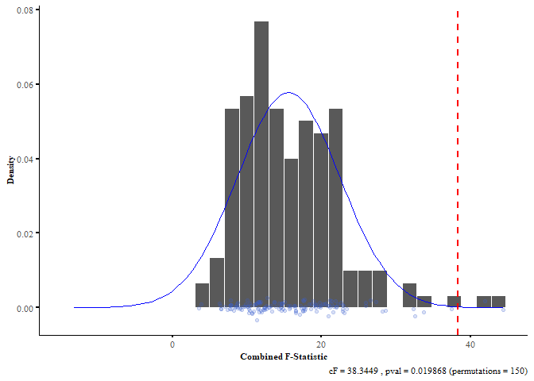
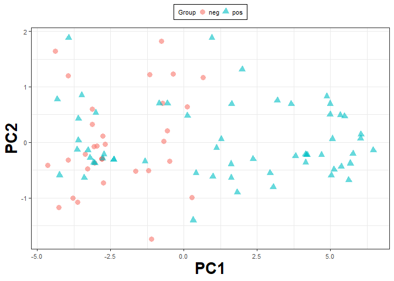
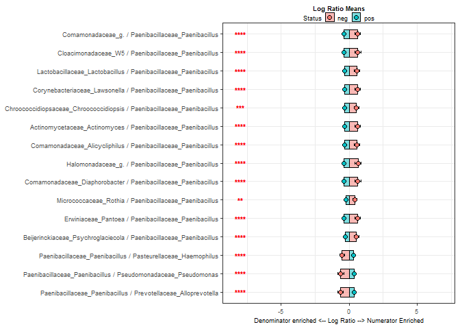
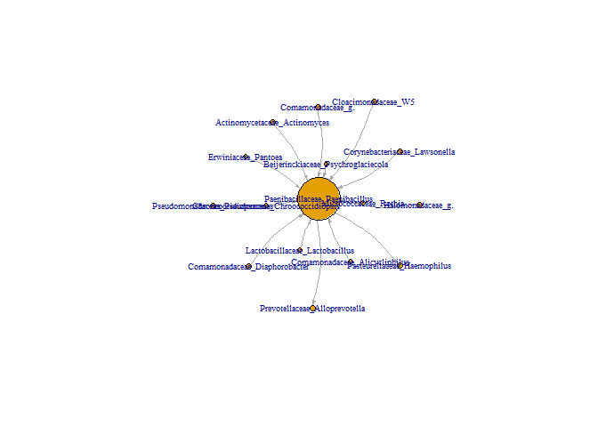

<!-- README.md is generated from README.Rmd. Please edit that file -->

# selEnergyPermR

<!-- badges: start -->

[](https://github.com/andrew84830813/selEnergyPermR/actions)
<!-- badges: end -->

Hinton, A.L. & Mucha, P. J., A simultaneous feature selection and
compositional association test for detecting sparse associations in
high-dimensional metagenomic data. 12 July 2021, PREPRINT (Version 1)
available at Research Square
<https://doi.org/10.21203/rs.3.rs-703177/v1>

The goal of selEnergyPermR package is to provide an easy to use set of
reusable functions for performing the selEnergyPerm methods for sparse
association testing in compositional data.

This Readme shows key steps required to perform and visualize a
selEnergyPerm Analysis

## Prerequisites

In order to use the ‘selEnergyPermR’ package the ‘diffCompVarRcpp’
package must first be installed. This package contains the cpp
implementation of the differential compositonal variation scoring
algorithm required for efficiently ranking logratios.

``` r
install.packages("devtools")
install.packages("ggplot2")
install.packages("permute")
install.packages("ggthemes")

devtools::install_github(repo = "andrew84830813/diffCompVarRcpp",
                         dependencies = T)

```

## Installation

Next install the latest version of selEnergyPermR from github with:

``` r
devtools::install_github(repo = "andrew84830813/selEnergyPermR",
                         dependencies = T)
```

## Example

This is a basic example which demonstrate how to use ‘selEnergyPermR’
for testing associations in count compositional data:

``` r
library(diffCompVarRcpp)
library(selEnergyPermR)
library(dplyr)
library(ggplot2)
library(permute)
library(ggthemes)
library(igraph)

## basic example code
```

Load the example dataset and view the first 5 rows and columns

``` r
data("Uguanda_PIH")


message("Number of rows (samples) = ",dim(Uguanda_PIH)[1], "\nNumber of columns (Class Label Columns + OTU's) = ",dim(Uguanda_PIH)[2])
#> Number of rows (samples) = 92
#> Number of columns (Class Label Columns + OTU's) = 369
```

## Pre-Process Sparisty and Impute Zeroes

``` r

## Detect Cores and Start Cluster (optional)
## ensure there is enough memory for parallel computing as multiple cores scales the amount of memory required
# num_cores = parallel::detectCores()-2
# clus <- parallel::makeCluster(10)
# doParallel::registerDoParallel(clus)


## Define Threshold for Sparisty (i.e. Taxa can be missing in up to [maxSparisty*100] percent of samples or present in at least 100 - [maxSparisty*100] percent of samples)
maxSparisty = .9

## Remove sparse features from Count data
message("Class Label Breakdown")
#> Class Label Breakdown
procData = selEnergyPermR::processCompData(Uguanda_PIH,minPrevalence = maxSparisty)
#> 
#> neg pos 
#>  34  58

## Extract processed data and zero impute factor for multiplicative replacement (See Hinton 2021)
dat = procData$processedData
impFact = procData$impFactor

## Remove any columns with all zero counts
y = dat[,-1]
bool = colSums(y)==0
y = y[,!bool]

## Close (Convert to relative abundance) and impute zeroes in OTU Table
dat = data.frame(Status = dat[,1],fastImputeZeroes( compositions::clo(y),impFactor = impFact))
#> Warning: executing %dopar% sequentially: no parallel backend registered

message("\n Number of OTUs remaining = ",ncol(y) )
#> 
#>  Number of OTUs remaining = 63
```

## Aggregate data to a the Genus Level

This step is optional as any level can be tested (i.e. Phylum,Class,
Order, etc..) as well as the overall OTU composition

``` r
## Aggregate to Genus
dat = data.frame(id = 1:nrow(dat),dat)
dat = tidyr::gather(dat,"taxa","count", 3:ncol(dat))
dat = tidyr::separate(dat,col = 3,into = c("p","c","o","family","genus","s"))
dat[dat=="null"] = NA
dat = dat %>%
  dplyr::filter(!is.na(family)) %>%
  dplyr::mutate(genus = if_else(is.na(genus),"g.",genus)) %>%
  dplyr::mutate(family_genus = paste0(family,"_",genus)) %>%
  dplyr::group_by(id,Status,family_genus) %>%
  dplyr::summarise(count = sum(count)) %>%
  tidyr::spread("family_genus","count") %>%
  dplyr::ungroup() %>%
  dplyr::select(-id)
#> `summarise()` has grouped output by 'id', 'Status'. You can override using the `.groups` argument.
dat = data.frame(dat)

message("\n Number of Unique Genera  = ",ncol(dat[,-1]) )
#> 
#>  Number of Unique Genera  = 57
```

## Compute Pairwise Logratios

This amount of time required for this step depends on number of cores
available and the dimensionality of the dataset (more taxa/OTU more
time). Usually computes in reasonable time for dimensions &lt;500 OTU’s
or taxa. Compute for a laptop with an 8th gen I9 with 32GB ram listed
below for reference. Important to make sure all zeroes have been imputed
and the data.frame is free of NA values or columns and/or rows that
contain all zeroes. Values do not necessarily need to be relative
abundance for this function to work. Values *MUST* be positive if not
using relative abundance.

``` r
## Compute Ratios
system.time({
lrs = calcLogRatio(dat)
})
#> Joining, by = "f"
#> Joining, by = "f"
#>    user  system elapsed 
#>    0.17    0.00    0.17
```

## Visulaize Dataset

``` r
rt = prcomp(lrs[,-1])
coords.df = data.frame(Group = lrs[,1],rt$x)
ggplot(coords.df,aes(PC1,PC2,col = Group))+
  geom_point(aes(shape = Group,fill  = Group),alpha = .6,size = 3)+
  theme_bw()+
  ggtitle("PCA of all pairwise logratios")+
  theme(legend.position = "top",
        axis.title = element_text(face = "bold",size = 20),
        axis.text = element_text(size = 8),
        #panel.grid = element_blank(),
        legend.key.size = unit(.05,units = "in"),
        legend.text = element_text(size = 8),legend.title = element_text(size = 8),
        legend.background = element_rect(colour = "black"))
```


## Test Sparse Assocition using selEnergyPerm

### Define Class Label Permutations for computing the null distribution

``` r
## Set seed for reproducibility
set.seed(08272008)


## Define Number of Permutations
permRep = 100
seeds = permute::shuffleSet(nrow(dat),nset = permRep)
seeds = data.frame(t(seeds))
```

### Apply SelEnergyPerm to compute test statistic and idenfity key taxa

``` r
## run SelEnergyPerm
sep.true = selEnergyPermR::selectionEnergy.scaled(inputData = dat)
res = data.frame(i =1:nrow(sep.true$optimResult),sep.true$optimResult)
ggplot(res,aes(i,optF))+
  geom_line(col = "red")+
  geom_line(aes(i,Value))+
  geom_text(aes(i,Value,label = numFeats))+
  ggtitle("SelEnergyPerm Forward Selection Optimization Results",subtitle = "Number of Features retained at each step shown")
```


### Extract Key Features and Test Statistic

``` r
## Get final features ####
feature.df = sep.true$finalSubset

## Retained DCV Scores####
lrs_dcv = sep.true$retainedDCV
lrs_dcv = lrs_dcv %>% 
  dplyr::filter(Ratio %in% colnames(feature.df[,-1]))

rxDCV = sep.true$rawDCV[,2:6]

## compute test statistics on selected subset ####
set.seed(08272008)
spEPerf = selEnergyPermR::featureSlectionPerformance(tbl = feature.df,Method_Name = "spE",
                                                     plot_ = F,nreps_energy = 1e6)
#> Joining, by = "Labels"
spEPerf.df = spEPerf$performance
targetRatios = spEPerf.df$NumRatios
optMetric = sep.true$optimization_Metric
if(optMetric=="combinedF"){
  testStat = spEPerf.df$combinedF
}else{
  testStat = spEPerf.df$EnergyF
}
testStat.df =  data.frame(Type = "empirical",
                          Seed = 08272008,
                          Exp.Name = "Tutorial",rep = 1,
                          num_ratios = ncol(feature.df),
                          tstat = testStat,
                          optMetric)
knitr::kable(testStat.df)
```

| Type      |    Seed | Exp.Name | rep | num\_ratios |    tstat | optMetric |
|:----------|--------:|:---------|----:|------------:|---------:|:----------|
| empirical | 8272008 | Tutorial |   1 |          10 | 32.98152 | combinedF |

### Compute Null Distribution

Here we use Monte-Carlo sampling from the permutation distribution to
test significance of the sparse association. We recommend at least 150
permutations.

``` r
## Null Results ####
seed_ = 08272208
nullPerf = data.frame()
nreps = 10
null.testStat = data.frame()
system.time({
  for(r in 1:nreps){

    suppressMessages(suppressWarnings({

      ## Run selection Energy Routine on permuted data
      null_data = dat
      null_data[,1] = null_data[seeds[,r],1]
      sep.null = selEnergyPermR::selectionEnergy.scaled(inputData = null_data,
                                        targetFeats = targetRatios,
                                        optimizationMetric = optMetric)

      ## Compute Null Metrics
      nullSubset = sep.null$finalSubset
      spEPerf.null = featureSlectionPerformance(tbl = nullSubset,Method_Name = "spE",plot_ = F)
      spEPerf.null.df = spEPerf.null$performance

      #store results
      nullPerf = rbind(nullPerf,spEPerf.null.df)

      if(optMetric=="combinedF"){
        null_tstat = spEPerf.null.df$combinedF
      }else{
        null_tstat = spEPerf.null.df$EnergyF
      }

      testStat.df = rbind(testStat.df,
                          data.frame(Type = "null",
                                     Seed = seed_,
                                     Exp.Name ="Tutorial",rep = r,
                                     num_ratios = ncol(nullSubset),
                                     tstat =null_tstat,
                                     optMetric)
                          )

    }))

    message("selPermEnergy ",r," of ",permRep)

  }
})
#>    user  system elapsed 
#>   35.81    0.67   35.51
```

## Visulaize SelEnergyPerm Association Test Results

``` r

t1.null = testStat.df %>% 
  filter(Type=="null")
t1.empi = testStat.df %>% 
  filter(Type!="null")
ph = rbind(t1.null,t1.empi[1,])
testStat =  unique(t1.empi$tstat)
dt = t1.null$tstat
1-ecdf(dt)(testStat)
#> [1] 0
mm = mean(dt)
ss = sd(dt)
pval = 1-pnorm(testStat,mean = mm,sd = ss)
# sep chat=rt

permRep = length(dt)
x = rnorm(1000,mean = mean(dt),sd(dt))
t_stat =  unique(t1.empi$tstat)
tstat_p =   (sum(t1.null$tstat>t_stat)+1)/ (nrow(t1.null)+1)
xden = density(x)$x
yden = density(x)$y
xx.df = data.frame(X = xden)
x.df = data.frame(X = xden,Y = yden)
jitter.df = data.frame(X = dt,jitter = rnorm(length(dt),quantile(yden,probs = .15),sd = 0.001))

ggplot(x.df,aes(X,Y))+
  geom_histogram(data = jitter.df,aes(y = ..density..),colour = "white") +
  stat_function(fun = dnorm, args = list(mean = mean(x), sd = sd(x)),col = "blue")+
  geom_point(data = jitter.df,aes(X,jitter),col = "royalblue3",alpha = .2)+
  ggthemes::theme_tufte()+
  ggthemes::geom_rangeframe() +
  geom_vline(xintercept = t_stat,lty = "dashed",col = "red",size = .75)+
  xlab("Combined F-Statistic")+
  ylab("Density")+
  labs(caption = paste0("cF = ",round(t_stat,digits = 4)," , pval = ",
                        round(tstat_p,digits = 6), " (permutations = ",permRep,")"))+
  theme(
    axis.line = element_line(),
    strip.text = element_text(face = "bold"),
    strip.text.y = element_text(angle = 0,face = "bold",size = 6,hjust = 0),
    axis.ticks = element_line(colour = "black",size = 1),
    #axis.title.y = element_blank(),
    axis.title = element_text(size = 8,face = "bold"),
    legend.position = "top",
    legend.text = element_text(size = 6),
    legend.margin = margin(0,0,0,0,unit = "cm"),
    legend.box.spacing = unit(0,units = "in"), 
    legend.box.margin = margin(0,0,0.1,0,unit = "cm"),
    legend.key.height = unit(.1,units = "in"),
    axis.text =  element_text(size = 8),
    #axis.text.y = element_blank(),
    legend.title =element_blank(),
    plot.caption = element_text(size = 8))
#> `stat_bin()` using `bins = 30`. Pick better value with `binwidth`.
```



## Visualize the reduced logratio signature with PCA

``` r
pc = prcomp(feature.df[,-1])
coords.df = data.frame(Group = feature.df[,1],pc$x)
plloading = data.frame(taxa = rownames(pc$rotation),pc$rotation)
plloading$taxa = stringr::str_replace(plloading$taxa,pattern = "___"," / ")

ggplot(coords.df,aes(PC1,PC2,Fill = Group))+
  geom_point(aes(shape = Group,col  = Group),alpha = .6,size = 3)+
  theme_bw()+
  theme(legend.position = "top",
        axis.title = element_text(face = "bold",size = 20),
        axis.text = element_text(size = 8),
        #panel.grid = element_blank(),
        legend.key.size = unit(.05,units = "in"),legend.text = element_text(size = 8),legend.title = element_text(size = 8),
        legend.background = element_rect(colour = "black"))
```



## Visualize key logratios between groups

``` r
# Log ratio means ---------------------------------------------------------
rp = data.frame(id = 1:nrow(feature.df),Status = feature.df[,1],feature.df[,-1])
rp = rp %>%
  tidyr::gather("taxa","log_ratio",3:ncol(rp))
rp$taxa = stringr::str_replace(rp$taxa,pattern = "___"," / ")
dd = rp %>%
  dplyr::group_by(taxa) %>%
  rstatix::wilcox_test(data =., log_ratio ~ Status) %>%
  rstatix::adjust_pvalue(method = "BH") %>%
  rstatix::add_significance("p.adj") %>%
  dplyr::arrange(dplyr::desc(-p))


rp = data.frame(id = 1:nrow(feature.df),Status = feature.df[,1],feature.df[,-1])
rp = rp %>% 
  tidyr::gather("taxa","log_ratio",3:ncol(rp)) %>% 
  dplyr::group_by(Status,taxa) %>% 
  dplyr::summarise(n = n(),
            lb =  mean(log_ratio) - ((1.96*mean(log_ratio))/sqrt(n)),
            ub =  mean(log_ratio) + ((1.96*mean(log_ratio))/sqrt(n)),
            log_ratio = mean(log_ratio),
  )
#> `summarise()` has grouped output by 'Status'. You can override using the `.groups` argument.
rp$taxa = stringr::str_replace(rp$taxa,pattern = "___"," / ")

rp = dplyr::left_join(rp,dd)
#> Joining, by = "taxa"
rp = dplyr::left_join(rp,plloading[,1:2])
#> Joining, by = "taxa"
rp = rp %>% 
  dplyr::arrange(desc(PC1))
rp$taxa = factor(rp$taxa,levels = unique(rp$taxa))

ggplot(rp,aes(taxa,log_ratio,fill  = Status,label = p.adj.signif))+
  geom_col(position = position_identity(),alpha = .5,col = "black",width = .5)+
  geom_errorbar(aes(ymin = lb,ymax = ub),width = .15,size = .5)+
  geom_point(aes(fill = Status),pch = 21,size = 2)+
  theme_bw()+
  coord_flip()+
  ggtitle("Log Ratio Means")+
  geom_text(nudge_y = 1,size = 3,fontface = "bold",y = -8,col = "red" )+
  scale_y_continuous(limits = c(-8.5,7))+
  ylab("Denominator enriched <-- Log Ratio --> Numerator Enriched")+
  #geom_hline(yintercept = 0)+
  ggsci::scale_fill_lancet()+
  ggsci::scale_color_lancet()+
  theme(legend.position = "top",plot.title = element_text(size = 7,hjust = .5,face = "bold"),
        #plot.margin = margin(0.5, 0.5, 0.5, 0.5),
        axis.title = element_text(size = 7),
        axis.title.y = element_blank(),
        #axis.text.y = element_text(size = 7),
        #axis.text.y = element_blank(),
        #legend.margin=margin(-1,-1,-1,-1),
        strip.switch.pad.wrap = margin(0,0,0,0),
        legend.margin=margin(-5,-10,-10,-10),
        axis.text = element_text(size = 7),
        #panel.grid = element_blank(),
        legend.key.size = unit(.15,units = "in"),
        legend.text = element_text(size = 7),
        legend.title = element_text(size = 7),
        #legend.background = element_rect(colour = "black")
  )
```


\#\# Visualize Log Ratio Network

``` r
imp.df = data.frame(Ratio = lrs_dcv$Ratio,Imp = lrs_dcv$rowmean)
keyRats = tidyr::separate(imp.df,1,into = c("Num","Denom"),sep = "___",remove = F)
el_= data.frame(keyRats$Num,keyRats$Denom,keyRats$Ratio)
g = igraph::graph_from_edgelist(as.matrix(el_[,1:2]),directed = T)
g = igraph::simplify(g, remove.loops = TRUE,
                     edge.attr.comb = igraph_opt("edge.attr.comb"))
E(g)$weight = if_else((imp.df$Imp)<0,0,(imp.df$Imp))
#g = minimum.spanning.tree(graph = g,weights = -E(g)$weight)
w_degree  = strength(g,mode = "total")
plot(g,layout = igraph::layout.kamada.kawai,
     vertex.label.cex = .65,
     vertex.size = igraph::strength(g,mode = "all")*.5+3,
     edge.curved = .2,
     edge.arrow.size = .25)
```


